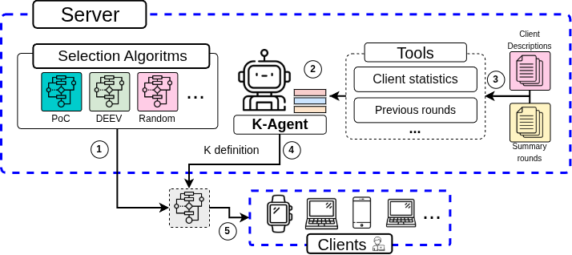

# Agentic Federated Learning - Selection Agent

**Paper:** *[Agentic Federated Learning: The Future of Distributed Training Orchestration](https://openreview.net/forum?id=JBy40fjKoH&noteId=JBy40fjKoH)*  
**Venue:** ICLR 2026 Workshop on AI for Mechanism Design and Strategic Decision Making
```
@article{jarczewski2026agentic,
  title={Agentic Federated Learning: The Future of Distributed Training Orchestration},
  author={Jarczewski, Rafael O and Talasso, Gabriel U and Villas, Leandro and de Souza, Allan M},
  journal={arXiv preprint arXiv:2604.04895},
  year={2026}
}
```
## Scope and Artifact Status

This repository contains the implementation and result artifacts used in the **proof-of-concept experiments reported in the appendix** of the ICLR workshop paper above.

- The experiments and outputs in this repository are the same ones referenced in the paper appendix.
- The `notebooks/iclr2026` folder name is kept for historical compatibility, but it now serves as appendix-analysis material for the ICLR workshop submission.

<figure>
    
    <figcaption>Perception-reasoning-action workflow of K-Agent.</figcaption>
</figure>

## Table of Contents

- [Scope and Artifact Status](#scope-and-artifact-status)
- [Overview](#overview)
- [Dependencies](#dependencies)
- [Security Notes](#security-notes)
- [Environment Setup](#environment-setup)
  - [Ollama Setup](#ollama-setup)
  - [Repository Setup](#repository-setup)
- [Minimal Test](#minimal-test)
- [Experiments (ICLR Appendix)](#experiments-iclr-appendix)
  - [Claim 1 - Faster Convergence with K-Agent](#claim-1---faster-convergence-with-k-agent)
  - [Claim 2 - Robustness Under Dynamic Sampling](#claim-2---robustness-under-dynamic-sampling)
  - [Experiment Automation](#experiment-automation)
- [License](#license)

## Overview

- Goal: provide a reproducible workflow to evaluate federated client selection strategies with Flower and LLM-based agents.
- Main components: federated server in `selection-agent/selection_agent/server_app.py`, clients in `selection-agent/selection_agent/client_app.py`, selection strategies in `selection-agent/selection_agent/selections`, and the LLM controller in `selection-agent/selection_agent/agent/k_agent.py`.
- Supporting artifacts: analysis notebooks in `notebooks/iclr2026` (figures, tables, and utilities) and automation scripts in `scripts`.
- Recommended environment: Linux; x86 CPU with 8 cores and 16 GB RAM; optional CUDA-capable GPU (driver compatible with PyTorch 2.7.1); at least 10 GB disk space.
- Base software: Python 3.10+, Flower 1.23+, PyTorch 2.7.1, and Ollama for local LLM execution.

## Dependencies

- Python libraries listed in `requirements.txt` (Flower, torch 2.7.1, torchvision 0.22.1, LangChain/LangGraph, Transformers, PEFT, TRL, bitsandbytes).
- System dependencies: GCC toolchain, `libpython-dev`, and optional GPU drivers.
- Benchmarks/datasets: MNIST and CIFAR10 via Flower Datasets. No proprietary datasets are required.
- External service: Ollama with model `qwen3:0.6b` (`ollama pull qwen3:0.6b`) for K-Agent runs.
- Shell scripts expect helper script `utils/k_start_ollama.sh` to orchestrate Ollama startup; if unavailable, start Ollama manually before running scripts.

## Security Notes

- Ollama exposes a local HTTP API; restrict machine access or configure firewalls during evaluation.
- No personal data is collected; only training/evaluation metrics are processed.
- Scripts do not require elevated privileges; run everything inside a dedicated virtual environment.

## Environment Setup

### Ollama Setup

This project uses **Ollama** to run LLMs locally.

1. Install Ollama:

- **macOS & Windows:** download from `https://ollama.com/download`
- **Linux:**

```bash
curl -fsSL https://ollama.com/install.sh | sh
```

- **Docker (optional):**

```bash
docker run -d -v ollama:/root/.ollama -p 11434:11434 --name ollama ollama/ollama
```

2. Pull the model(s) used by your experiment setup, for example:

```bash
ollama pull qwen3:0.6b
```

### Repository Setup

```bash
git clone <repository-url>
cd k-agent
python -m venv .venv
source .venv/bin/activate
pip install --upgrade pip
pip install -r requirements.txt
pip install -e selection-agent
ollama pull qwen3:0.6b
```

Optional GPU check:

```bash
python -c "import torch; print(torch.cuda.is_available())"
```

## Minimal Test

1. Start `ollama serve` in a separate terminal (required only when `selection-method=k-agent`).
2. In `selection-agent/pyproject.toml`, set `selection-method="random"` and `num-server-rounds=1` under `[tool.flwr.app.config]`.
3. Run:

```bash
cd selection-agent
flwr run . local-simulation
```

4. Expected outcome: creation of a model file like `models/<timestamp>_random_..._final_model_.pt` and training/evaluation logs in terminal output.

## Experiments (ICLR Appendix)

General setup: tune parameters in `[tool.flwr.app.config]` in `selection-agent/pyproject.toml`. Each run generates metrics in `outputs/` and model artifacts in `models/`.

### Claim 1 - Faster Convergence with K-Agent

- Set in `selection-agent/pyproject.toml`: `selection-method='k-agent'`, `prompt-type="chain-of-thought"`, `num-supernodes=25`, `sample-size=-1`, `k-agent-selection-method='oort_selection'`, `num-server-rounds=50`.
- Requirements: Ollama running with `qwen3:0.6b`; 4 vCPUs, 16 GB RAM; around 3h for 50 rounds.
- Command:

```bash
cd selection-agent
flwr run . local-simulation
```

- Expected outcome: JSON files in `outputs/` showing parameter-traffic reduction between 44.4% and 59% versus random selection while keeping similar accuracy. Consolidate plots with `notebooks/iclr2026/figura2-figura-3.ipynb`.

### Claim 2 - Robustness Under Dynamic Sampling

- Set in `selection-agent/pyproject.toml`: `selection-method='oort'`, `sample-size=-2`, `num-supernodes=25`, `num-server-rounds=50`, `delay=true`, `delay-perc=0.2`, `delay-rounds='11,12,13,14,15'`.
- Requirements: 8 CPU cores, 12 GB RAM, around 2h runtime.
- Command:

```bash
cd selection-agent
flwr run . local-simulation
```

- Expected outcome: `outputs/` metrics indicating accuracy above 94% under induced delay and up to 20% less bandwidth usage than the fixed baseline. Generate figures with `notebooks/iclr2026/figura4.ipynb`.

### Experiment Automation

- Script `scripts/k_agent_prompt_type.sh` automates prompt and LLM-model variants. Before running, grant execution permission (`chmod +x scripts/k_agent_prompt_type.sh`), export `CUDA_VISIBLE_DEVICES`, and start Ollama (manually or with `utils/k_start_ollama.sh`). Run from repository root using `./scripts/k_agent_prompt_type.sh 0`.
- Aggregated table outputs can be reproduced with notebooks `notebooks/iclr2026/tabela2-tabela-3.ipynb` and `notebooks/iclr2026/tabela2-tabela-3-literatura.ipynb`, which consume files from `results/`.

## License

Apache 2.0, as declared in `selection-agent/pyproject.toml`.
